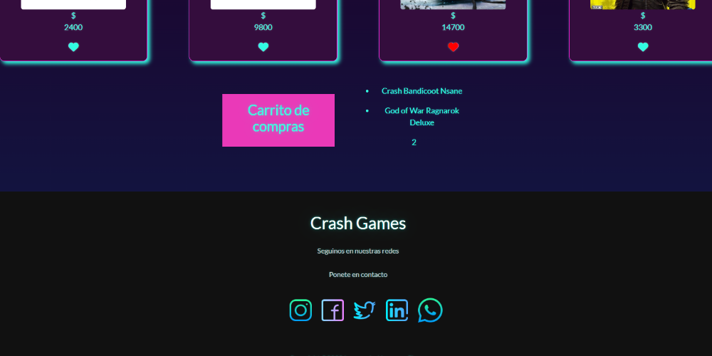

## ♦ CRASH GAMES ♦

## CLIENTES WEB MOBILE
#
### Trabajo realizado por grupo de alumnos donde se desarrolla sitio web e-commerce en lenguaje JavaScript Vue aplicando directivas y el DOM
#
---------------------------------------------
Detalles del sitio

---------------------------------------------
#
#
## Cuenta con un Buscador de productos y un card para agregar productos 

#
### Separados en card con el heart span se puede agregar a la lista de productos deseados

#
### Carrito de compras y Footer

Gracias por revisar nuestro repositorio! ♥